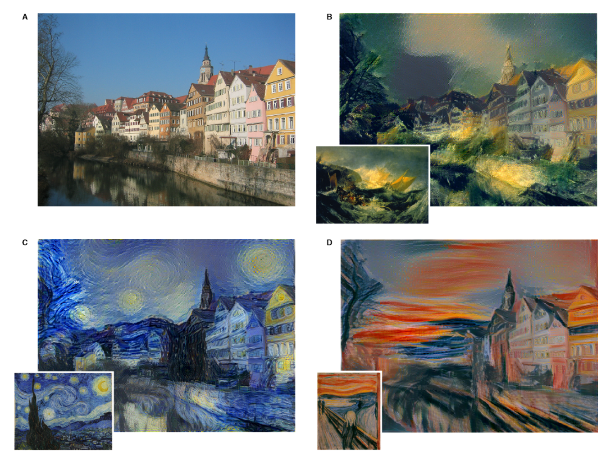

# Generative Deep Learning with TensorFlow
 
Generative Deep Learning is an interesting field, and an area that i find fascinating, the first time i hear about it were in relation to style transfer and the paper [A Neural Algorithm of Artistic Style](https://arxiv.org/abs/1508.06576) and i thought it was fantastic that it was possible to take the artistic style of one image and apply it to another

But Generative Deep Learning is not limited to images, and has also shown to be able to produce both meaningful text and [music](https://arxiv.org/abs/1612.01010).
 
## Style Transfer
Style Transfer is a technique where you combine in this case images, to get a new image with the style from one image and the content from the other.
In a neural network trained to classify images, will be structured with low level filters at the input and higher level filters at the output, when doing style transfer this structure is utilized as the style of an image correspond to what the network has in its lower level filters, and the content or objects are recognised by the higher level filters.
 
The paper [A Neural Algorithm of Artistic Style](https://arxiv.org/abs/1508.06576) combines information from the content and the style image as shown in the diagram below

In a training loop the Style Loss and the Content Loss is minimized by applying the gradient to the generated image, changing it to minimize the style difference between the content and style image, while at the same time minimizing the content difference between the content and the generated image.
The paper starts out with a trained VGG-19 network, the network is not updated in the training loop, only the generated image is updated to minimize the combined loss 
Example of this network: [Neural Style Transfer](./C4_W1_Lab_1_Neural_Style_Transfer.ipynb)
 
The process described above is quite slow, and a faster approach were suggested in [Fast Neural Style Transfer](https://arxiv.org/abs/1705.06830), to see this in action you can download the model from TF Hub, as shown here: [Fast Neural Style Transfer example](./C4_W1_Lab_2_Fast_NST.ipynb)
## AutoEncoder
Autoencoders can be used to produce a more dense representation of some data, while trying to maintain the important information. This can be used as a preprocess for some other learning network, for noise removal, or when extended as a Variational AutoEncoders it can also be used to produce new data.
 
This is an example of a simple NN Autoencoder for MNIST digits

[FashionMNIST CNNAutoEncoder](./C4_W2_Lab_4_FashionMNIST_CNNAutoEncoder.ipynb) Simple AutoEncoder using CNN, that can learn to construct fashionMNIST images
 
[FashionMNIST NoisyCNNAutoEncoder](./C4_W2_Lab_5_FashionMNIST_NoisyCNNAutoEncoder.ipynb) Same network, showing how you can remove noise, by adding noise to the input of the AutoEncode, and still have the denoised images as the output while training the network
 
 
## Variational AutoEncoders (VAEs)
The Variational AutoEncoder extends on the standard AutoEncode by adding randomness into the bottleneck layer, allowing the network to learn to produce new images that are similar to the training images.

An introduction to VAE's can be found in this paper [An Introduction to Variational Autoencoders](https://arxiv.org/abs/1906.02691) 
A good starting colab is the [official tutorial from Tensorflow](https://colab.research.google.com/github/tensorflow/docs/blob/master/site/en/tutorials/generative/cvae.ipynb#scrollTo=HrJRef8Ln945)
 
 
 
##  Generative Adversarial Networks (GANs)
 
Gans is probably the most interesting area when it comes to Generative Deep Learning, with a wide range of use cases, from generating realistic looking fases, state of the art image upscaling, and creating images matching a text description. a good compilation of use cases are found [here](https://machinelearningmastery.com/impressive-applications-of-generative-adversarial-networks/)
 
To train a GAN you need some data that represents what you would like the GAN to produce, if you want it to produce faces you need images of fases, the data dont need to be labeled, but just need to be similar to what you want the network to produce.
 
The network architecture consists of 2 neural networks, a generator that produces "fake" samples, and a Discriminator that is trained to distinguish the generated samples from real ones.

The training loop has two phases, first the Discriminator is trained to distinguish fake from real, secondly the Discriminators weights are frozen and the Generator is set to generate some fake samples, and the discriminator then have to predict how "real" each fake image is, and the results are fed back to the Generator so it is updated to produce more real looking images.
This loop is repeated the Discriminator is given more and more "real" looking images, making it better at distinguishing real from fake, and the generator is given the knowledge about what generated images looked most real so it can generate more real looking images, and in this way the networks are Dueling each other hence the word Adversarial Networks
 
When building GAN Neural Networks for images there are some best practices that is explained in this paper [Unsupervised Representation Learning with Deep Convolutional Generative Adversarial Networks](https://arxiv.org/pdf/1511.06434.pdf)
 
[CelebA GAN Experiments](./C4_W4_Lab_3_CelebA_GAN_Experiments.ipynb) is an implementation using these best practices to generate low resolution faces from the celebrity faces dataset. It can run in colab using TPU to speed up training