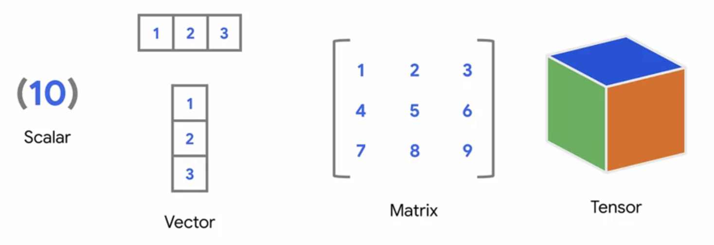

# Custom and Distributed Training with TensorFlow
 
## Tensors, Eager Mode and Gradient Tape

### Tensors
Tensors are flexible data structures, that stores data of any dimention

It can be a scaler containing only a single value, a horizontal or vertical vector, or a matrix of 2 or more dimentions.  
An example of a multi dimentional vector is an image with 3 color channels which will be in the shape of height x width x 256 x 3 x batch_size at the time it is send to tensorflow for training

The tensorflow guide has a good [Introduction to Tensors](https://www.tensorflow.org/guide/tensor)

Understanding Tensors becomes important when you want to write your own tensorflow operations like Custom Layers, Cost functions or when you want to speed up data preprocessing. and i think everybody at some point or another have been cursing about tensorflow giving you errors because the input shape of your data is not matching the input shape of your network.

```python
tf.Variable([1,2,3], dtype=float32)
tf.Constant([1,2,3], dtype=float32)
```
Tensors can be created in tensorflow as [tf.Variable](https://www.tensorflow.org/api_docs/python/tf/Variable) or [tf.constant](https://www.tensorflow.org/api_docs/python/tf/constant)
The values of Variables can be changed after they are declared, where constants can not, so thinks like the weights of a network need to be variables, while things like the training data can be a constant

When working with tensorflow tensors, the [tensorflow math operations](https://www.tensorflow.org/api_docs/python/tf/math) has to be used.

### Tensors in Eager Mode

 
### Siamese network
Another great example of using the functional api is the siamese network that constructs a model that takes images as input and gives a score telling how similar the images are. special for the network is that both sides of the network are in fact the same network with the same weight. 
The Example also uses a lamda layers and custom loss function, something that is explained in more detail later.
[Siamese network example](./C1_W1_Lab_3_siamese-network.ipynb)
 
## Custom loss function
Keras have several [build loss functions](https://keras.io/api/losses/) but sometimes they might not fit the learning problem you want to solve, like in the Siamese network.
for these scenarios you can build and use your own custom loss function.
Custom loss functions can be build in a function or a class.
when building it as a class the input parameters are always y_true and y_pred and you cant pass any other parameters. 
I prefer to alway build loss functions as classes as it allows parsing other variables to the loss function, making it configurable to different scenarios, or to allow tuning of the loss functions hyperparameters.
 
```python
def model()
# wrapper function that accepts the hyperparameter
def my_huber_loss(threshold):
    # function that accepts the ground truth and predictions
   def my_huber_loss(y_true, y_pred):
       error = y_true - y_pred
       is_small_error = tf.abs(error) <= threshold
       small_error_loss = tf.square(error) / 2
       big_error_loss = threshold * (tf.abs(error) - (0.5 * threshold))
      
       return tf.where(is_small_error, small_error_loss, big_error_loss)
 
   # return the inner function tuned by the hyperparameter
   return my_huber_loss
 
model = tf.keras.Sequential([keras.layers.Dense(units=1, input_shape=[1])])
model.compile(optimizer='sgd', loss=my_huber_loss(threshold=1.2))
```
Remember to use the [tensorflow math operations](https://www.tensorflow.org/api_docs/python/tf/math) inside the loss function.
It is possible to use normal math operations syntax on operations like multiplication and addition as they are overloaded. So when using these on tensorflow tensors the tf operations are used.
 
[C1_W2_Lab_2_huber-object-loss.ipynb](./C1_W2_Lab_2_huber-object-loss.ipynb) Full example of the my_huber_loss
[C1W2_Assignment.ipynb](./C1W2_Assignment.ipynb) implements [RMSE](https://www.tensorflow.org/api_docs/python/tf/keras/metrics/RootMeanSquaredError) as a custom loss function
 
## Lambda Layers & Custom Layers
 
lambda layers can be used when the [build-in keras layers](https://keras.io/api/layers/) don't have the functionality you need, and the functionality you want in your layer is fairly simple. For more complex functionality you want to creat a custom layer, which will be described a bit later.
### Lambda Layers
The following is a simple lamda layer, that is taking the absolute values just the same way as [relu activation](https://keras.io/api/layers/activations/#relu-function).
```python
tf.keras.layers.Lambda(lambda x: tf.abs(x))
```
Replacing relu activation with a lamda layer is of course not so useful or exiting, but it shows the use of lamda layers. 
[C1_W3_Lab_1_lambda-layer.ipynb](./C1_W3_Lab_1_lambda-layer.ipynb) example of lamda layer in use
 
### Custom Layers
Custom layers can extend the keras base layer, unlike lamda layers custom layers have a state, and and can be trainable.
Below is an example of a custom dense layer, that has the states w(weight) and b(bias)
When extending keras base layer you need to implement the init, build and call function.
```python
class SimpleDense(Layer):
 
   # add an activation parameter
   def __init__(self, units=32, activation=None):
       super(SimpleDense, self).__init__()
       self.units = units
      
       # define the activation to get from the built-in activation layers in Keras
       self.activation = tf.keras.activations.get(activation)
 
 
   def build(self, input_shape):
       w_init = tf.random_normal_initializer()
       self.w = tf.Variable(name="kernel",
           initial_value=w_init(shape=(input_shape[-1], self.units),
                                dtype='float32'),
           trainable=True)
       b_init = tf.zeros_initializer()
       self.b = tf.Variable(name="bias",
           initial_value=b_init(shape=(self.units,), dtype='float32'),
           trainable=True)
       super().build(input_shape)
 
 
   def call(self, inputs):
      
       # pass the computation to the activation layer
       return self.activation(tf.matmul(inputs, self.w) + self.b)
```
[C1_W3_Lab_3_custom-layer-activation.ipynb](./C1_W3_Lab_3_custom-layer-activation.ipynb) example of custom layers in use
[C1W3_Assignment.ipynb](./C1W3_Assignment.ipynb) example of a custom quadratic layer applied to fashion MNIST
 
## Custom Models
An alternative to creating your model in a function, it is also possible to extend the [Model class](https://keras.io/api/models/model/).
Extending the model class should give you additional control and the possibility to change the way data flows through the network.
[XLNet](https://github.com/tensorflow/models/blob/master/official/nlp/modeling/models/xlnet.py) is an example that uses model subclassing. but you can easely write modular and configurable network without it.
 
An example of [ResNet](https://github.com/tensorflow/models/blob/master/official/vision/image_classification/resnet/resnet_model.py) from tensorflow repo that does not subclass tf.keras.Model
 
And an example of [ResNet](./C1_W4_Lab_2_resnet-example.ipynb) from the course using subclassing, this example is less code mainly because it does not implement the full ResNet model
 
When extending the model class the init and call function should be implemented
```python
class MyModel(tf.keras.Model):
 
 def __init__(self):
   super(MyModel, self).__init__()
   self.dense1 = tf.keras.layers.Dense(4, activation=tf.nn.relu)
   self.dense2 = tf.keras.layers.Dense(5, activation=tf.nn.softmax)
 
 def call(self, inputs):
   x = self.dense1(inputs)
   return self.dense2(x)
```
Finally a [VGG network](./C1W4_Assignment.ipynb) example using subclassing
 
## Built-in and Custom Callbacks
 
### Built-in callbacks
There are a number of [built-in](https://www.tensorflow.org/api_docs/python/tf/keras/callbacks) callbacks. A callback is specified in the training loop, and is called before and after each epoch.
My favorites are EarlyStopping and TensorBoard. The first lets you stop the training when a number of epochs have not shown any improvements, and it can save the best model. Tensorboard saves a log file that can be opened by tensorboard, and is a great way to investigate how the training progressed, and also a good way to document each of your experiments
 
```python
model = build_model(dense_units=256)
model.compile(
   optimizer='sgd',
   loss='sparse_categorical_crossentropy',
   metrics=['accuracy'])
 
logdir = os.path.join("logs", datetime.datetime.now().strftime("%Y%m%d-%H%M%S"))
tensorboard_callback = tf.keras.callbacks.TensorBoard(logdir)
 
early_stopping_callback = EarlyStopping(patience=3,
                                       min_delta=0.05,
                                       baseline=0.8,
                                       mode='min',
                                       monitor='val_loss',
                                       restore_best_weights=True,
                                       verbose=1)
 
model.fit(train_batches,
         epochs=50,
         validation_data=validation_batches,
         verbose=2,
         callbacks=[early_stopping_callback, tensorboard_callback]
         )
```
[C1_W5_Lab_1_exploring-callbacks.ipynb](./C1_W5_Lab_1_exploring-callbacks.ipynb) shows how to use many of the build in callbacks
 
### Custom callbacks
Custom callbacks are a great way to implement logic that has to run before or after an epoch, this might be to log something, or to determine if training has to stop, or maybe to adjust hyperparameters while training.
 
The custom callback below shows how to stop training if the loss and validation loss is starting to diverge
```python
class DetectOverfittingCallback(tf.keras.callbacks.Callback):
   def __init__(self, threshold=0.7):
       super(DetectOverfittingCallback, self).__init__()
       self.threshold = threshold
 
   def on_epoch_end(self, epoch, logs=None):
       ratio = logs["val_loss"] / logs["loss"]
       print("Epoch: {}, Val/Train loss ratio: {:.2f}".format(epoch, ratio))
 
       if ratio > self.threshold:
           print("Stopping training...")
           self.model.stop_training = True
 
model = get_model()
_ = model.fit(x_train, y_train,
             validation_data=(x_test, y_test),
             batch_size=64,
             epochs=3,
             verbose=0,
             callbacks=[DetectOverfittingCallback()])
```
 
More example are found [here](./C1_W5_Lab_2_custom-callbacks.ipynb)

